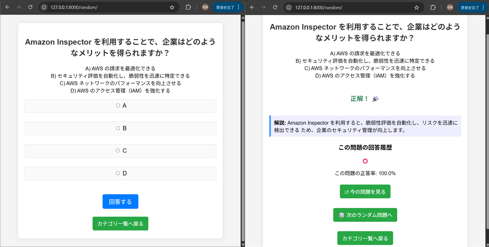

# AWS 4択クイズアプリ（Django製）

AWS認定クラウドプラクティショナー（CLF）試験対策用の  
4択形式のクイズ学習Webアプリです。  
Djangoで開発されており、ローカル環境で手軽に動作します。

---

## このアプリでできること

- AWSに関する4択クイズの出題と解答
- 問題ごとの正誤判定とスコア表示
- Django管理画面から問題の追加・編集・削除が可能
- Bootstrapベースの軽量なUI

---

## 画面イメージ



---

## 使用技術

- Python 3.x
- Django 5.1.2
- SQLite3
- HTML / CSS（Bootstrap）
- Pillow（画像表示用）

---

## セットアップ手順

1. このリポジトリをクローン：

```bash
git clone https://github.com/muratter93/aws_4_choice-quiz.git
cd aws_4_choice-quiz
```

2. 仮想環境を作成・起動（Windowsの場合）：

```bash
python -m venv venv
venv\Scripts\activate
```

※Mac/Linux の場合：

```bash
source venv/bin/activate
```

3. 依存パッケージをインストール：

```bash
pip install -r requirements.txt
```

4. マイグレーションと起動：

```bash
python manage.py migrate
python manage.py runserver
```

5. ブラウザでアクセス：

[http://127.0.0.1:8000](http://127.0.0.1:8000)

---

## 管理画面の使い方

管理ユーザーを作成：

```bash
python manage.py createsuperuser
```

→ 任意のユーザー名・メール・パスワードを入力して  
→ [http://127.0.0.1:8000/admin/](http://127.0.0.1:8000/admin/) にアクセス！

---

## ライセンス

MIT License

---

## 作者

- muratter93  
- GitHub: [https://github.com/muratter93](https://github.com/muratter93)

---

